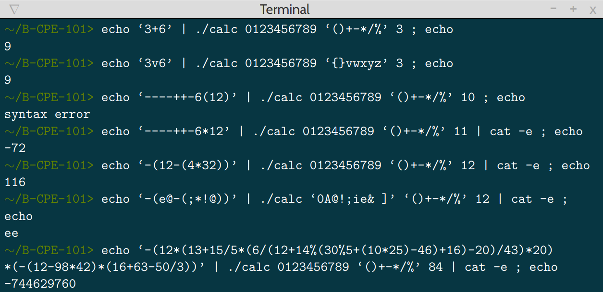

# Bistro-Matic

The goal of this project is to reproduce bc, an arbitrary precision calculator language in the shell,
and to display a mathematical expression.

The expression is composed of integers and operations in any base.
The program must handle the following operators: +-*/%, parentheses, operation priorities and syntax errors,
but not float numbers.

